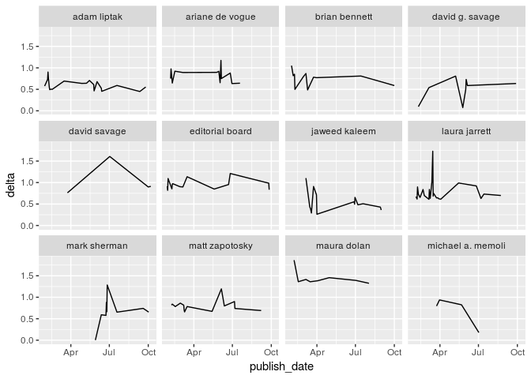

Setup
-----

loading libraries

    library(tidyverse)
    library(jsonlite)
    library(tidyjson)
    library(widyr)
    library(tidytext)
    library(ggridges)
    library(lubridate)

    options(scipen = 99)

    source("utils.R")

Loading data
------------

    news_articles <- fromJSON("data/1996_dicts_9_sources.json", simplifyDataFrame = T) %>%
      as.tibble()

    news_articles

    ## # A tibble: 1,996 x 10
    ##    title  url   text   top_words summary source publish_date authors id   
    ##  * <chr>  <chr> <chr>  <list>    <chr>   <chr>  <chr>        <list>  <chr>
    ##  1 Appea… http… "The … <chr [13… "The 1… cnn    2017-05-25   <chr [… 1    
    ##  2 Elon … http… "Tesl… <chr [16… "Tesla… cnn    2017-01-30   <chr [… 2    
    ##  3 Donal… http… "J.P.… <chr [14… "J.P. … cnn    2017-01-30   <chr [… 8    
    ##  4 Donal… http… "The … <chr [14… "Meanw… cnn    2017-02-06   <chr [… 9    
    ##  5 More … http… "Majo… <chr [18… "On Tu… cnn    2017-02-07   <chr [… 10   
    ##  6 Presi… http… "Pres… <chr [14… "Presi… cnn    2017-02-21   <chr [… 12   
    ##  7 Eliza… http… "Know… <chr [12… "“Turn… cnn    2017-03-16   <chr [… 13   
    ##  8 Tech … http… "The … <chr [14… "The i… cnn    2017-01-28   <chr [… 14   
    ##  9 Here'… http… "Afte… <chr [14… "After… cnn    2017-01-28   <chr [… 15   
    ## 10 GE's … http… "Gene… <chr [16… "Gener… cnn    2017-01-29   <chr [… 16   
    ## # ... with 1,986 more rows, and 1 more variable: type <chr>

Tidying and Nesting
-------------------

1.  Count authors, only keep single author news articles.
2.  Remove duplicates, and keep only text based duplicates if source is
    differenct.
3.  Remove columns that are not relevant to the scope of this project.
4.  Nest based on author, store article count.
5.  Select top 10 (or more if similar number of articles exist) authors
    based on article count.

<!-- -->

    nested_articles <- news_articles %>%
      distinct(text, source, .keep_all = T) %>%
      mutate(length = map_int(authors, length)) %>%
      filter(length < 2) %>%
      unnest(authors) %>%
      select(text, author = authors, publish_date, source) %>%
      group_by(author) %>%
      nest() %>%
      mutate(article_count = map_int(data, nrow)) %>%
      top_n(10, article_count)
      
    nested_articles

    ## # A tibble: 12 x 3
    ##    author            data              article_count
    ##    <chr>             <list>                    <int>
    ##  1 laura jarrett     <tibble [31 × 3]>            31
    ##  2 ariane de vogue   <tibble [15 × 3]>            15
    ##  3 mark sherman      <tibble [15 × 3]>            15
    ##  4 adam liptak       <tibble [26 × 3]>            26
    ##  5 editorial board   <tibble [23 × 3]>            23
    ##  6 matt zapotosky    <tibble [17 × 3]>            17
    ##  7 michael a. memoli <tibble [15 × 3]>            15
    ##  8 maura dolan       <tibble [15 × 3]>            15
    ##  9 david savage      <tibble [15 × 3]>            15
    ## 10 jaweed kaleem     <tibble [62 × 3]>            62
    ## 11 david g. savage   <tibble [16 × 3]>            16
    ## 12 brian bennett     <tibble [32 × 3]>            32

We now have a tibble of the 12 authors with the most number of articles.
We can then write a generic function that maps over each author and then
calculates the distances of each authors news articles from their first
article during the travel ban proposal.

    temporal_delta <- function(df) {
      df %>%
        mutate(
          text = str_replace_all(tolower(text), paste0(source, "|story highlights"), "")
        ) %>%
        select(-source) %>%
        group_by(publish_date) %>%
        unnest_tokens(word, text) %>%
        count(word) %>%
        ungroup() %>%
        mutate(
          publish_date = lubridate::ymd(publish_date)
        ) %>%
        bind_tf_idf(publish_date, word, n) %>%
        pairwise_delta(publish_date, word, tf_idf, upper = F) %>%
        filter(item1 == min(item1)) %>%
        transmute(
          publish_date = item2,
          delta
        )
    }

    temporal_delta(nested_articles[1, ]$data[[1]])

    ## # A tibble: 24 x 2
    ##    publish_date delta
    ##    <date>       <dbl>
    ##  1 2017-02-03   0.687
    ##  2 2017-02-04   0.680
    ##  3 2017-02-06   0.634
    ##  4 2017-02-07   0.885
    ##  5 2017-02-09   0.745
    ##  6 2017-02-13   0.668
    ##  7 2017-02-20   0.839
    ##  8 2017-02-23   0.714
    ##  9 2017-03-06   0.625
    ## 10 2017-03-07   0.851
    ## # ... with 14 more rows

If we map this to all writer's data, we get the following plot:

    author_deltas <- nested_articles %>%
      mutate(ts_delta = map(data, temporal_delta)) %>%
      unnest(ts_delta)

    author_deltas %>%
      ggplot(aes(publish_date, delta)) + 
      geom_line() + 
      facet_wrap(~author)

Alternate metric.
-----------------

Instead of using normalized frequencies, we can consider using the term
frequency - inverse document frequency of each word in the document and
then select the words with the highest tf-idf with some threshold. The
threshold can be derived from...

    nested_articles[1, ]$data[[1]] %>%
      mutate(
        text = str_replace_all(tolower(text), paste0(source, "|story highlights"), "")
      ) %>%
      select(-source) %>%
      group_by(publish_date) %>%
      unnest_tokens(word, text) %>%
      count(word) %>%
      ungroup() %>%
      mutate(
        publish_date = lubridate::ymd(publish_date)
      ) %>%
      bind_tf_idf(publish_date, word, n) %>%
      group_by(publish_date) %>%
      arrange(publish_date, tf_idf) %>%
      filter(tf_idf >= quantile(tf_idf, 0.9)) %>%
      ungroup() %>%
      arrange(publish_date) %>%
      pairwise_delta(publish_date, word, tf_idf, upper = F) %>%
      filter(item1 == min(item1)) %>%
      transmute(
        publish_date = item2,
        delta
      ) %>%
      ggplot(aes(publish_date, delta)) + 
      geom_line()

Same author different sources.
------------------------------

    source_deltas <- news_articles %>%
      distinct(text, source, .keep_all = T) %>%
      mutate(length = map_int(authors, length)) %>%
      filter(length < 2) %>%
      unnest(authors) %>%
      select(text, author = authors, publish_date, source) %>%
      group_by(author) %>%
      nest() %>%
      mutate(
        sources = map_int(data, function(x) {
          x %>%
            distinct(source) %>%
            pull(source) %>%
            length()
        })
      ) %>%
      filter(sources > 1) %>%
      mutate(
        data = map(data, add_rowid),
        deltas = map(data, function(x) {
          x %>%
            mutate(article_id = paste(source, article_id, sep = "_")) %>%
            group_by(article_id) %>%
            unnest_tokens(word, text) %>%
            count(article_id, word) %>%
            group_by(article_id) %>%
            mutate(p_word = n/sum(n)) %>%
            ungroup() %>%
            pairwise_delta(article_id, word, p_word)
        })
      )

    source_deltas %>%
      select(author, deltas) %>%
      unnest() %>%
      filter(author == "mark sherman") %>%
      select(-author) %>%
      multi_scale(item1, item2, delta) %>%
      # separate(item, into = c("source", "id"), sep = "_") %>%
      ggplot(aes(V1, V2, color = item)) + 
      geom_point() +
      geom_text(aes(label = item)) +
      scale_y_continuous(limits = c(-0.75, 0.75))

